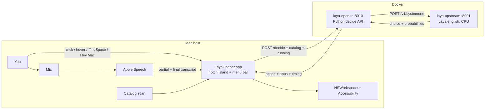
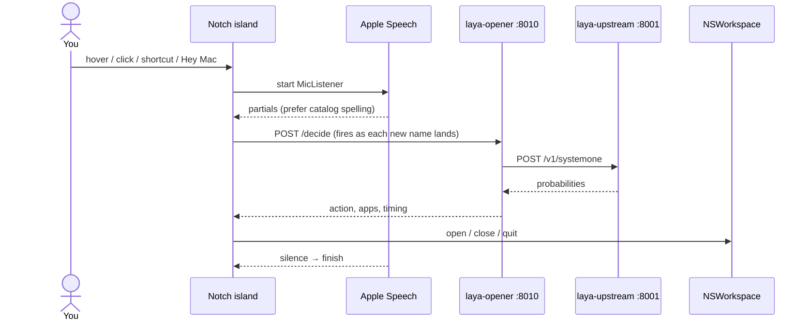

# Laya Island

Voice on the Mac notch → **Laya in Docker** → open, close, quit, or force-quit the named installed app.

This product exists to **test Laya**, not to bypass it. Every utterance is a Laya prompt. The Mac app only listens, shows the island, and executes. Inference never runs on the host.

> **No cloud LLM.** No OpenAI, Anthropic, Gemini, or any remote chat API. Speech is Apple Speech. The app pick is Laya System-1 (`laya-upstream`) running **on this machine, in Docker, on CPU**. Offline once the image is loaded (`HF_HUB_OFFLINE=1`). The host never calls a model.

```
You  →  notch island  →  POST :8010/decide     (laya-opener, this repo)
                              │
                              ▼
                     POST :8001/v1/systemone   (laya-upstream)
                              │
                              ▼
                     open / close / quit / kill
```

| You say | What happens |
|---|---|
| *open notes* | Opens Notes |
| *jot something down* | Opens Notes (paraphrase) |
| *open anti gravity* | Opens Antigravity |
| *open her mess* / *open hermits* | Opens Hermes (ASR aliases) |
| *open podcast and notes* | Opens both |
| *open youtube in brave* | Opens YouTube in Brave |
| *open clipboard* | Opens whatever is on the clipboard |
| *close brave* | Closes Brave windows (app stays running) |
| *quit brave* / *kill brave* | Quits or force-quits Brave |
| *hello* / unknown name | Opens **nothing** |
| *goodbye* | Island says Goodbye and the app quits |

## Architecture



| Process | Where | Port | Job |
|---|---|---|---|
| `LayaOpener.app` | `~/Applications/LayaOpener.app` | — | Notch UI, mic, Apple Speech, catalog scan, execute |
| `laya-opener` | Docker, **this repo** | `127.0.0.1:8010` | Decide API. Builds the Laya prompt. Policy + alias recovery. |
| `laya-upstream` | Docker, **separate image** | `127.0.0.1:8001` | Laya System-1 English checkpoint on CPU |



Full internals: [docs/how-it-works.md](docs/how-it-works.md). Speech notes: [docs/speech-recognition.md](docs/speech-recognition.md). Latency notes: [docs/voice-to-open-latency.md](docs/voice-to-open-latency.md).

## Requirements

- **macOS 14+** on Apple Silicon (the notch app is `arm64-apple-macos14.0`)
- **Xcode Command Line Tools** (`xcode-select --install`) — Swift, clang, codesign
- **Docker Desktop** or OrbStack, with the Docker CLI on `PATH`
- **`laya-upstream:latest`** already on the machine. This repo does **not** ship the model image. The opener container talks to it at `http://host.docker.internal:8001`.
- First run: grant **Microphone** and **Speech Recognition**. First *close*: grant **Accessibility** once.

If you do not have `laya-upstream:latest`, `docker compose up` will fail on the `laya` service. Build or load that image from the Laya project first, then come back here.

## Run locally

```bash
git clone https://github.com/AshutoshKY/laya-island.git
cd laya-island
./launch
```

`./launch` will:

1. Refuse if Docker is not running (and try to open Docker Desktop).
2. `docker compose up -d --build` (or rebuild only `opener` if `laya-upstream` is already a container).
3. Poll `http://127.0.0.1:8010/health` for up to 60 s.
4. Build `LayaOpener.app` if it is missing, then `open` it.

Check the pods:

```bash
docker compose ps
curl -sS -m 3 http://127.0.0.1:8010/health
# expect: {"status": "ok", "laya": true}
```

Then:

- Click the purple notch dot, press **⌃⌥Space**, hover the notch (~500 ms), or say **Hey Mac** / **Bhai Mac**.
- Say *open notes*, *jot something down*, *remind me later*.
- Right-click the menu-bar waveform for **Settings** (per-trigger on/off, wake phrases, hover wait, shortcut, listening master, Quit).
- Say *goodbye* to dismiss.

Do **not** run `python -m opener` or any Laya process on the Mac. Inference and decide both stay in Docker.

### First-time app build only

```bash
./scripts/build_app.sh
open "$HOME/Applications/LayaOpener.app"
```

That compiles the Swift accessory, signs it with a stable “Laya Opener” identity (so TCC grants survive rebuilds), and copies it to `~/Applications/LayaOpener.app`.

### Optional: start at login

```bash
./scripts/install_launch_agent.sh
```

Restarts on crash; stays dead after Quit from the menu.

### Python-only changes (no .app rebuild)

```bash
docker build -t laya-app-opener:latest .
docker rm -f laya-opener
docker compose up -d --no-deps opener
curl -sS -m 3 http://127.0.0.1:8010/health
```

### Swift / Info.plist / signing changes

```bash
./scripts/build_app.sh
kill $(pgrep -n LayaOpener); sleep 1
open "$HOME/Applications/LayaOpener.app"
```

`ditto` overwrites the bundle but does not replace a live process. Confirm a new pid with `pgrep -lf LayaOpener`.

## Tests

Unit suite (no Docker, no mic):

```bash
PYTHONPATH=. python3 -m unittest discover -s tests -q
```

Live Laya checks (`tests/test_live_laya.py`) skip unless `:8001` is healthy. With the stack up they lock:

- `open anti gravity` → `antigravity`
- `open podcast and notes` → `apps: [podcasts, notes]`
- `open her mess` → `hermes`
- `open cloud flare` → `cloudflarewarp`
- `open youtube in brave` → `open_url` + `https://www.youtube.com` + `brave`

Probe decide yourself:

```bash
curl -sS http://127.0.0.1:8010/decide \
  -H 'Content-Type: application/json' \
  -d '{"text":"open notes","catalog":{"notes":{"say":"Notes","aliases":["notes"],"criteria":"Notes.app"}},"running":[],"pending":[]}'
```

## Repo layout

```
laya-island/
├── launch                         # compose up + open the notch app
├── docker-compose.yml             # laya-upstream :8001, laya-opener :8010
├── Dockerfile                     # python:3.12-slim → opener.server
├── catalog.json                   # curated daily catalog (copied into the .app)
├── opener/                        # runs ONLY in Docker
│   ├── server.py                  # GET /health, POST /decide
│   ├── loop.py                    # split / Laya / alias recover
│   ├── client.py                  # questions_for + POST Laya
│   ├── policy.py                  # Decision from probabilities
│   ├── alias.py                   # spoken_key, resolve_alias, prefer_catalog
│   └── …
├── native/notch/                  # Swift accessory (LayaOpener.app)
├── scripts/
│   ├── build_app.sh
│   ├── ensure_codesign.sh
│   ├── install_launch_agent.sh
│   └── com.laya.opener.plist      # template; __HOME__ substituted on install
├── docs/                          # internals, speech, latency
└── tests/
```

Python and Swift keep alias / speech-form / `preferCatalog` rules in lockstep.

## Product rules

- Voice-first, **English only**.
- **Every utterance calls Laya.** Host matching may add extras or recover an exact installed name after Laya asks. It must not skip the call.
- Missing or unrecognized → open nothing. No Calendar / Chrome / default-browser fallthrough.
- Several names in one phrase (`and` / `,` / `then`) → act on every hit.
- Close = windows only (one Accessibility grant). Quit / kill = `terminate` / `forceTerminate`. Finder and Laya Opener are protected.
- `open <site> in <app>` and `open clipboard` are parsed on the host; Laya still names the app. Unknown site with no app → ask, no default-browser guess.

## What this is not

- Not a general Siri / Spotlight replacement.
- Not a Laya playground (that is the Laya repo).
- Not an on-host model runner.
- Not a second speech engine.
- Not a fallback-to-Chrome product.
- Not a ChatGPT / Claude / Gemini wrapper. There is no cloud LLM in this stack.

## License

MIT. See [LICENSE](LICENSE).
