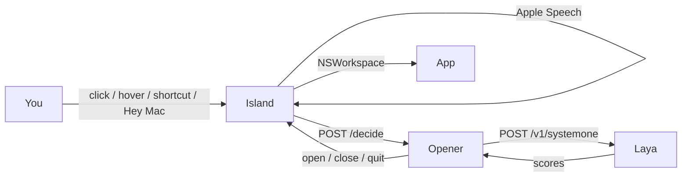

# Sayso

Speak at the Mac notch. The named app opens.

Hover the purple dot, press **⌃⌥Space**, or say **Hey Mac**. A black island drops. You talk. Laya — running **on this Mac, in Docker, no internet** — picks the installed app. Sayso opens it, closes its windows, or quits it.

> **No cloud LLM.** Not ChatGPT. Not Claude. Not Gemini. Speech is Apple Speech. The decision is Laya System-1 on CPU. Once the image is loaded, the stack is offline.

```
You speak  →  notch island hears it  →  Laya picks the app  →  Mac does it
```

| You say | What happens |
|---|---|
| *open notes* | Opens Notes |
| *jot something down* | Opens Notes (it understood the paraphrase) |
| *open anti gravity* | Opens Antigravity |
| *open her mess* | Opens Hermes (Apple misheard; we still got it) |
| *open podcast and notes* | Opens both, as each name lands |
| *open youtube in brave* | YouTube, in Brave — not “some browser” |
| *open clipboard* | Opens whatever you just copied |
| *close brave* | Closes the windows; Brave stays running |
| *quit brave* / *kill brave* | Quits or force-quits |
| *hello* | Opens **nothing** |
| *goodbye* | Island says goodbye and Sayso quits |

Unknown name → nothing. No silent fallthrough to Chrome or Calendar.

## At a glance

| | |
|---|---|
| What this is | A Mac notch companion that tests [Laya](https://github.com/AshutoshKY) by sending **every** utterance through it |
| What lives here | Swift notch app + Python decide API (`laya-opener`) + tests + docs |
| What does **not** live here | The Laya model. You need `laya-upstream:latest` already on the machine |
| Platform | macOS 14+, Apple Silicon |
| Languages | Python 3.12 (decide API) · Swift / AppKit (island) |
| Cloud calls | **None.** No OpenAI / Anthropic / Gemini. Host never talks to a model |
| Speech | Apple Speech only (`en-US`). No Whisper, no second engine |
| Model | Laya System-1 English, CPU, `HF_HUB_OFFLINE=1` |
| Named-app decide | **~250 ms** p50 (5-way head) |
| Paraphrase decide | **~400 ms** p50 (daily 15-way set) |
| App launch | **33–53 ms** (`NSWorkspace`) |
| Felt “open antigravity” | App starts while you are still saying *“…app”* |
| Tests | 206 unit tests · live Laya suite when `:8001` is up |
| License | MIT |

How the pieces fit (plain language):

1. The island listens with the Mac’s own speech recognizer.
2. It asks the decide service on `localhost:8010` — “what did they mean?”
3. That service asks Laya on `localhost:8001` — still this machine, still Docker.
4. Laya returns scores. Policy + a few spoken-name aliases pick the app.
5. The island opens, closes, or quits it.

Diagrams and the full stack map: [docs/how-it-works.md](docs/how-it-works.md). Speech write-up: [docs/speech-recognition.md](docs/speech-recognition.md). Latency numbers: [docs/voice-to-open-latency.md](docs/voice-to-open-latency.md).



| Piece | Where | Port | Job |
|---|---|---|---|
| `LayaOpener.app` | `~/Applications` | — | Island, mic, speech, catalog, execute |
| `laya-opener` | Docker, **this repo** | `127.0.0.1:8010` | Decide API |
| `laya-upstream` | Docker, **separate image** | `127.0.0.1:8001` | Laya English, CPU |

## Run it

Needs: macOS 14+ on Apple Silicon, Xcode Command Line Tools, Docker Desktop or OrbStack, and a local `laya-upstream:latest` image. First launch: grant **Microphone** and **Speech Recognition**. First *close*: grant **Accessibility** once.

If `laya-upstream:latest` is missing, compose will fail on the `laya` service. Load that image from the Laya project first.

```bash
git clone https://github.com/AshutoshKY/sayso.git
cd sayso
./launch
```

`./launch` starts Docker, waits for `http://127.0.0.1:8010/health` (`{"status":"ok","laya":true}`), builds the app if needed, and opens the island.

Then click the purple notch dot, press **⌃⌥Space**, hover (~500 ms), or say **Hey Mac** / **Bhai Mac**. Right-click the menu-bar waveform for Settings. Say *goodbye* to dismiss.

Do **not** run `python -m opener` or Laya on the Mac. Decide and inference stay in Docker.

### First-time app build

```bash
./scripts/build_app.sh
open "$HOME/Applications/LayaOpener.app"
```

### Start at login (optional)

```bash
./scripts/install_launch_agent.sh
```

Restarts on crash; stays dead after Quit from the menu.

### Ship a Python change (no .app rebuild)

```bash
docker build -t laya-app-opener:latest .
docker rm -f laya-opener
docker compose up -d --no-deps opener
```

### Ship a Swift / signing change

```bash
./scripts/build_app.sh
kill $(pgrep -n LayaOpener); sleep 1
open "$HOME/Applications/LayaOpener.app"
```

`ditto` overwrites the bundle but not a live process.

## Tests

```bash
PYTHONPATH=. python3 -m unittest discover -s tests -q
```

Mac-only catalog scans skip on Linux CI. Live Laya checks skip unless `:8001` is healthy. With the stack up they lock:

- `open anti gravity` → `antigravity`
- `open podcast and notes` → `apps: [podcasts, notes]`
- `open her mess` → `hermes`
- `open cloud flare` → `cloudflarewarp`
- `open youtube in brave` → `open_url` + YouTube + `brave`

```bash
curl -sS http://127.0.0.1:8010/decide \
  -H 'Content-Type: application/json' \
  -d '{"text":"open notes","catalog":{"notes":{"say":"Notes","aliases":["notes"],"criteria":"Notes.app"}},"running":[],"pending":[]}'
```

## What's in the box

```
sayso/
├── launch                         # compose up + open the island
├── docker-compose.yml             # laya-upstream :8001, laya-opener :8010
├── Dockerfile                     # python:3.12-slim → opener.server
├── catalog.json                   # curated daily catalog
├── opener/                        # decide API — Docker only
├── native/notch/                  # Swift island (LayaOpener.app)
├── scripts/                       # build, codesign, LaunchAgent
├── docs/                          # internals, speech, latency
└── tests/                         # 206 unit + live Laya
```

## Rules that do not bend

- Voice-first, English only.
- Every utterance calls Laya. Aliases recover after the model answers; they never skip it.
- Unknown → open nothing.
- Several names in one phrase → act on every hit.
- Close = windows (one Accessibility grant). Quit / kill = terminate. Finder and Sayso are protected.

## What this is not

- Not Siri. Not Spotlight.
- Not a Laya playground (that is the Laya repo).
- Not an on-host model runner.
- Not a ChatGPT / Claude / Gemini wrapper.

## License

MIT. See [LICENSE](LICENSE).
