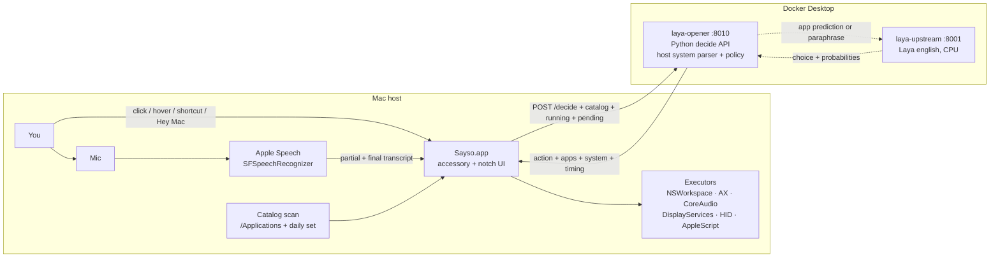
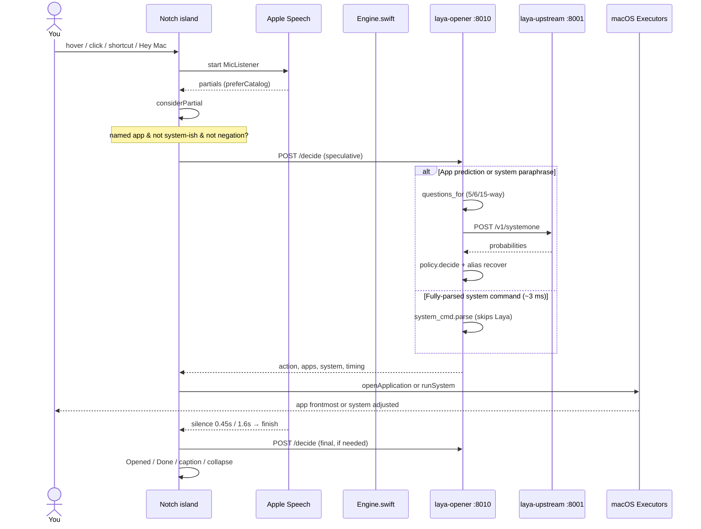

# How Sayso works

Voice on the Mac notch → Laya in Docker → open / close / quit the named installed app.

This product exists to **test Laya**, not to bypass it. Every utterance is a Laya prompt. The Mac app only listens, shows the island, and executes. Inference never runs on the host. There is no cloud LLM in the path.

```
mic  →  notch  →  POST :8010/decide   (laya-opener container)
                         │
               ┌─────────┴─────────┐
               ▼                   ▼
      [host system parse]     POST :8001/v1/systemone (laya-upstream container)
      (~3 ms, skips Laya)          │
               │                   ▼
               │              app prediction / system paraphrase
               └─────────┬─────────┘
                         ▼
             open / close windows / quit / force quit /
             volume / brightness / dark mode / lock / battery / panes / airdrop
```

Architecture and request-flow diagrams are in this file and the [README](../README.md). Latency investigation notes: [`voice-to-open-latency.md`](voice-to-open-latency.md). Speech investigation notes: [`speech-recognition.md`](speech-recognition.md).

---

## 1. What it does

You click the purple notch dot, hover the notch (default 500 ms, configurable), press the shortcut (default **⌃⌥Space**), click the menu-bar waveform, or say **Hey Mac** / **Bhai Mac**. The black hardware island drops. You speak English. Laya picks an installed Mac app, or the host parses system commands. That app opens, closes, quits, or the Mac executes system controls.

| You say | What happens |
|---|---|
| *open notes* | Opens Notes |
| *jot something down* | Opens Notes (paraphrase, daily set) |
| *remind me later* | Opens Reminders |
| *open anti gravity* / *open antigravity app* | Opens Antigravity (compact id + trailing-filler strip) |
| *open her mess* / *open hermits* | Opens Hermes (ASR confusion aliases) |
| *open cloud flare* | Opens Cloudflare WARP |
| *open podcast and notes* | Opens both |
| *open calculator, antigravity and notes* | Opens all three as each name lands; listen stays up until a quiet gap |
| *open the browser* | Opens the system default browser |
| *close brave* | Closes Brave windows (app stays running) if Brave is open |
| *quit brave* / *kill brave* / *force quit brave* | Quits or force-quits Brave if it is running |
| *close brave* when Brave is not open | Island: “Brave isn't open. Open it?” Yes opens; no refuses |
| *hello* / weather / unknown name | Opens **nothing** |
| *goodbye* | Island says Goodbye and the app quits |
| *increase volume by 2* | Volume up 20% (steps are 10%; *by 2 percent* = 2%) |
| *volume up* / *mute* / *set volume to 50* | CoreAudio hardware volume on default output device |
| *make the screen brighter* / *dim the screen* | DisplayServices brightness ∓10% |
| *turn on dark mode* / *light mode* | System appearance toggle via AppleScript |
| *night mode on* | Night Shift on |
| *lock screen* | Locks the Mac (synthetic ⌃⌘Q) |
| *battery percentage* | Real battery level & charging state via IOKit |
| *open wifi settings* / *open bluetooth settings* | That System Settings pane opens |
| *turn off airdrop* | AirDrop off (*airdrop everyone* turns it back on) |
| *open notes and increase volume by 2* | Mixed app + system commands compose |
| *hey mac open notes and safari* | Wake + multi-app list held in one breath |
| *hey mac increase volume by 2* | Wake + system control in one breath |

Rules that do not bend:

- Voice-first, **English only** (`en-US` recognizer).
- **Every utterance calls Laya.** Host matching may add extras to the prompt or recover an exact installed name after Laya asks. It must not skip the call.
- Fully-parsed system commands (volume, brightness, appearance, lock, battery, panes, AirDrop) are host-parsed and skip Laya (`open clipboard` precedent) in ~3 ms. Paraphrases without gate words still query Laya's `system` head.
- Missing or unrecognized → open nothing. No Calendar / Chrome / default-browser fallthrough for unknown speech.
- Several names in one utterance (`and` / `,` / `then`) → Laya each part, act on every hit.
- Open / close / quit Laya's highest-scoring **catalog** app. `unspecified` never wins.
- Close = windows only (Accessibility, one grant). Quit / kill / force quit = terminate. Finder and Sayso are protected.
- `open youtube in brave` / `open github.com in safari` / `open clipboard` → host parses the site, Laya names the app, Mac opens the URL in that app. No default-browser guess when the app is unnamed.
- First launch: grant **Microphone** and **Speech Recognition**. First close: grant **Accessibility** once.

Start the stack with `./launch` from the repo root. Do not run `python -m opener` or any Laya process on the Mac.

---

## 2. System map

Three processes, two machines-worth of isolation, one loopback.



| Process | Where | Port | Job |
|---|---|---|---|
| `Sayso.app` | `~/Applications/Sayso.app` | — | Notch UI, mic, Apple Speech, catalog scan, open / close / quit, native system controls |
| `laya-opener` | Docker, this repo | `127.0.0.1:8010` | Decide API. System command parsing (~3 ms), Laya prompt builder, policy, alias recovery |
| `laya-upstream` | Docker, `laya-upstream:latest` | `127.0.0.1:8001` | Laya System-1 English checkpoint on CPU |

The opener container reaches Laya at `http://host.docker.internal:8001/v1/systemone`. The Mac app reaches the opener at `http://127.0.0.1:8010/decide`.

---

## 3. Tools and stack

### Native (the notch)

| Tool | Used for |
|---|---|
| **Swift + AppKit + SwiftUI** | Accessory app, island chrome, idle dot |
| **Speech.framework** (`SFSpeechRecognizer`) | Only recognizer. No Whisper, no custom LM |
| **AVFoundation** (`AVAudioEngine` tap) | Mic buffers into the recognizer |
| **ObjC `LayaTry`** | Catch `NSException` from `installTap` / `removeTap` so the accessory does not abort |
| **Carbon `RegisterEventHotKey`** | Configurable shortcut (default ⌃⌥Space) |
| **NSWorkspace** | Launch the chosen `.app`; `terminate` / `forceTerminate` for quit / kill |
| **Accessibility (`AXUIElement`)** | Close windows via the window close button. One Accessibility grant, not per-app Automation |
| **CoreAudio** (`AudioObjectGetPropertyData`/`SetPropertyData`) | Master volume and mute on default output device (works on HDMI/DisplayPort) |
| **DisplayServices** (`DisplayServicesSetBrightness`) | Native display brightness control (macOS 26 int status signature) |
| **IOKit (`IOPMPowerSource`)** | Real battery percentage and power source state |
| **ApplicationServices / CGEvent** | Synthetic ⌃⌘Q lock screen trigger |
| **NSAppleScript** | Dark / light appearance toggle via System Events |
| **NSStatusItem** | Menu-bar waveform. Left-click listens, right-click Settings / listening / Quit |
| **UserDefaults `com.laya.opener`** | Listening master, per-trigger on/off (shortcut / hover / click / wake), wake phrases, hover dwell, shortcut, decision backend |
| **LaunchAgent `com.laya.opener`** | Start at login. Restart on crash, stay dead on Quit |
| **codesign** | Stable “Laya Opener” identity so TCC (mic/speech) survives rebuilds |
| **`/usr/bin/say -v Samantha`** | Present in `Engine.speak` (island itself is silent) |

Permissions in `Info.plist`: `NSMicrophoneUsageDescription`, `NSSpeechRecognitionUsageDescription`, `NSAudioCaptureUsageDescription`. `LSUIElement = true` (no Dock icon). First close may prompt **Accessibility** once (Privacy & Security → Accessibility). Quit / kill do not need it.

### Decide API (Docker)

| Tool | Used for |
|---|---|
| **Python 3.12-slim** | `python -m opener.server` |
| **`ThreadingHTTPServer`** | `GET /health`, `POST /decide` |
| **stdlib `urllib`** | Call Laya. No FastAPI in this container |
| **`catalog.json` / `opener/catalog.py`** | Curated daily apps + criteria |
| **`opener/system_cmd.py`** | Host-parsed volume, brightness, appearance, lock, battery, panes, AirDrop (~3 ms) |
| **`opener/scan.py`** | Spoken-form / alias generation (Swift has a twin) |

### Model

| Tool | Used for |
|---|---|
| **Laya System-1** `POST /v1/systemone` | Choice head over installed apps & system paraphrases |
| **`model: english`** | Only checkpoint this product loads |
| **CPU, `OMP_NUM_THREADS=4`** | `LAYA_DEVICE=cpu`, `LAYA_PRELOAD=1` |
| **`HF_HUB_OFFLINE=1`** | Offline weights from `laya-upstream-model-cache` |

### Ship / verify

| Tool | Used for |
|---|---|
| **Docker Compose** | `laya` + `opener` services |
| **`./launch`** | Compose up, wait on `:8010/health`, `open` the `.app` |
| **`scripts/build_app.sh`** | Compile Swift, sign, `ditto` to `~/Applications` |
| **`unittest`** | `PYTHONPATH=. python3 -m unittest discover -s tests -q` |
| **`curl`** | Health + replay `/decide` |

---

## 4. File map

```
laya-app-opener/
├── launch                         # docker compose + open the notch app
├── docker-compose.yml             # laya-upstream :8001, laya-opener :8010
├── Dockerfile                     # python:3.12-slim → opener.server
├── catalog.json                   # bundled curated catalog (copied into the .app)
├── opener/                        # runs ONLY in Docker
│   ├── server.py                  # /health + /decide
│   ├── loop.py                    # wake strip / stop / split / Laya / alias recover
│   ├── system_cmd.py              # host-parsed volume, brightness, appearance, lock, battery, panes
│   ├── settings.py                # wake match, hover/hotkey/backend normalize
│   ├── client.py                  # questions_for + POST Laya
│   ├── policy.py                  # Decision from probabilities
│   ├── alias.py                   # spoken_key, resolve_alias, prefer_catalog
│   ├── catalog.py                 # curated APPS + merge scanned
│   ├── scan.py                    # Mac .app scan + speech phrases
│   ├── execute.py                 # open -a / say (host helpers; product uses Swift)
│   ├── defaults.py                # Launch Services default browser
│   └── dockerutil.py              # start containers if health is down
├── native/notch/
│   ├── NotchApp.swift             # UI, hotkey, hover, wake watch, listen loop, launch
│   ├── Settings.swift             # Preferences + settings window (lockstep with opener/settings.py)
│   ├── SpeechListen.swift         # MicListener: Apple Speech
│   ├── Engine.swift               # catalog, aliases, /decide client, openApp, native system controls
│   ├── ExceptionCatch.[hm]        # ObjC try/catch around AVAudioEngine taps
│   └── Info.plist
├── scripts/
│   ├── build_app.sh
│   ├── ensure_codesign.sh
│   ├── install_launch_agent.sh
│   └── com.laya.opener.plist      # template; __HOME__ substituted on install
└── tests/                         # 241 unit + live tests (including test_system_cmd.py)
```

Python and Swift keep alias / speech-form / `preferCatalog` rules in lockstep. Change one, change the other.

---

## 5. Voice recognition

Apple Speech is the only recognizer. There is no custom language model and no on-device vocabulary API beyond `contextualStrings` (≤100 short phrases, 3–32 chars).

### How a listen starts

Four triggers, one island. The wake listener stays on the same Apple Speech session through the command. A bare `hey mac` partial is **not** a commit — Apple almost always emits that first, then `hey mac open`, then `hey mac open safari`. Committing on the prefix or on the verb alone used to fire `/decide` with no app and drop the rest. Hold ~450 ms for a bare wake; keep holding while the remainder is only a verb (`open` / `open the`). **Never seed on a streaming partial** — `beginSeeded` aborts the wake mic, so `hey mac open notes` committing mid-utterance drops `and safari`, and `hey mac increase volume` drops `by 2`. `wakeCommit(..., final:)` seeds only on the final transcript. The wake listener's short silence is only for a closed non-system list; first name / mid-list / system-ish keep the ~1.6 s hold. If the hang expires with nothing after the wake, start a normal listen.

| Trigger | Delay |
|---|---|
| Click the idle dot, island, or menu-bar waveform | Immediate |
| Shortcut (Carbon hotkey; default ⌃⌥Space) | Immediate |
| Hover the notch | Configurable dwell (default **500 ms**, 100–2000). Leave early → cancel. Pass-through must not start listen. After a listen, hover stays disarmed until the cursor leaves the notch — a parked mouse must not loop |
| Wake word (`hey mac`, `bhai mac`, plus ASR forms like `bye mac` / `hay mack`) | Immediate once the prefix matches. Always-on second `MicListener` while idle — this is what lights the orange Control Center mic indicator. Turn **Wake word** off in Settings to release the mic. Each trigger (shortcut / hover / click / wake) has its own toggle under the listening master. Aborted before a command listen so two audio taps never overlap |

`MicListener.prewarmPermissions()` runs at launch so the first listen is not the first TCC prompt.

### What Apple is asked to do

From `SpeechListen.swift`:

- Locale `en-US`
- `taskHint = .search` (app names, not `.dictation` prose)
- `shouldReportPartialResults = true`
- `addsPunctuation = false`
- `requiresOnDeviceRecognition = false` (Apple cloud dictation is allowed)
- `contextualStrings` = ranked catalog phrases, first 100

Phrase ranking (both Swift `speechPhrases` and Python `speech_phrases`) so the 100-slot cap does not fill with Notes / Safari:

0. Known ASR confusions (`her mess`, `hermits`, `hurmez`)
1. Compound brands (`cloud flare`, `anti gravity`)
2. Other unusual aliases
3. Common names last

### How a transcript is chosen

Every recognition callback collects:

1. `bestTranscription`
2. Every item in `transcriptions`
3. Each segment’s `alternativeSubstrings` spliced into the parent string

Then `preferCatalog` / `prefer_catalog_transcript`:

1. Walk hypotheses in Apple’s order.
2. Lock the **first named installed app**.
3. Prefer that app’s official spelling (`say` / `open` / id).
4. A later hypothesis that names a *different* app (`notes` after `hermits`) must not steal.

### When listen ends

| Condition | Hold |
|---|---|
| Partial names an installed app and the list is closed (`open A and B`) | **0.45 s** of *unchanged* text |
| Partial is mid-list (`Calculator` / `open A` / `open A B`) | **1.6 s** (wait for the next name) |
| Partial does not yet name an app | **1.6 s** (let alternatives arrive: `hermits` → `hermes`) |
| Hard ceiling | **12 s** from last change |
| Unchanged callbacks | Do **not** reset the clock |

After silence: `endAudio()`, stop the engine, `finish(best)` immediately. There is no extra 0.8 s wait.

`AVAudioEngine` is recreated per listen. Tap install/remove is wrapped in `LayaTry` because `installTap` raises an `NSException`, not a Swift `Error`.

### Speculative fire

`NotchApp.considerPartial` POSTs `/decide` as soon as a *new* installed name appears in the partial. Already-opened ids are skipped so “calculator, antigravity and notes” opens each app as it is named. Stop phrases, negations (`don't`, `never`), and lifecycle verbs (`close` / `quit` / `kill`) do not speculative-fire. Confirm follow-ups also wait for the final transcript.

Listen keeps the long (~1.6 s) hold while the list is still open. Apple often emits just `Calculator` mid-utterance — that is not finished. The short 0.45 s named hold only fires after a closed list (`open A and B`). A real silence after the last name collapses the island.

### Two failure layers

A miss that looks like “it didn’t recognise Hermes” is one of:

1. **ASR** — Apple never wrote the brand. Island transcript is wrong. Fix `speechForms` / `contextualStrings`.
2. **Decide** — transcript is useful, alias + Laya miss. Fix aliases + Laya criteria.

Check: read the island line, POST that exact string to `/decide`. If `/decide` already opens the right app, it is Apple.

Known confusions kept on both sides:

| Intended | Apple often says | Catalog id |
|---|---|---|
| Hermes | `her mes`, `her mess`, `hermits`, `hurmez` | `hermes` |
| Cloudflare WARP | `cloud flare`, `cloudflare`, `cloud flare warp` | `cloudflarewarp` |
| Antigravity | `anti gravity` | `antigravity` |

Do not singularise short names: `Hermes` is not a plural of `herme`. Only strip a trailing `s` when length ≥ 7 (`Podcasts` → `podcast`).

Do not add a second speech engine. Bias + alternatives + alias recovery first.

---

## 6. Decision engine

The Mac never decides the app. It POSTs:

```json
{ "text": "close brave", "catalog": { "<id>": { "say", "criteria", "aliases" } }, "running": ["brave"], "pending": [] }
```

`catalog` is the **live scanned** set (~100+ apps), not just the curated daily list.

### `/decide` path

```
server.decide_payload
  → loop.handle_utterance
       pending yes/no? → open or refuse (no Laya)
       stop phrase? → Decision(stop)
       system_cmd.parse fully parses? → Decision(system) (no Laya)
       split on and / , / then
       for each part:
         system_cmd.parse first; else client.predict → Laya
         policy.decide
         if not open/refuse: recover exact_installed_id or resolve_alias
       close/quit/kill verb? → close windows / quit / kill if running, else confirm
  → { action, app, apps, pending, system, reason, spoken, timing }
```

Empty text does not call Laya. Fully-parsed system commands (volume, brightness,
appearance, Night Shift, lock, battery, Wi-Fi/Bluetooth panes, AirDrop) do not call
Laya either — the host parser produces `{verb, value}` directly. System-ish
paraphrases the host parser misses still reach Laya through a `system` question
head (gated by `looks_systemish`); `system_cmd.from_laya` converts the answer back
with default amounts. The island executes each command in Swift and the caption
reports the real outcome.

macOS 26 notes for the Swift executors (verified by disassembly + live runs):
`DisplayServicesGetBrightness` is now `(display, float*) -> int` (0 = ok, 1000 =
fail) — the old float-return signature crashes with SIGBUS/SIGSEGV.
`SACLockScreenImmediate` and the `CGSession` menu extra are gone; lock is a
synthetic ⌃⌘Q posted at the HID tap (the app is already Accessibility-trusted).
Volume uses CoreAudio on the default output device (works where
`osascript get volume settings` fails, e.g. HDMI/DisplayPort). Dark/light is a
System Events AppleScript (one-time Automation consent). ASR writes small numbers
as words — including homophones ("increase volume by two" arrives as "by to");
`system_cmd` maps those only after `by`, so "too bright" stays an intensifier.

### Choice-set construction (`questions_for`)

Laya cost is roughly linear in option count on this CPU box. The head is sized on purpose.

| Utterance looks like | Head | Typical Laya p50 |
|---|---|---|
| Names an installed app (`open notes`, `open her mess`) | That app + 3 distractors + `unspecified` (**~5-way**) | **~250 ms** |
| Browser (`browser`, `chrome`, `safari`, `brave`, `arc`/`ark`/`art`, `vivaldi`) | Installed browsers + unspecified (**~6-way**) | **~209 ms** |
| Paraphrase (`jot something down`) | Daily 15 + unspecified | **~400 ms** |

Daily ids: notes, reminders, mail, messages, finder, facetime, calendar, photos, maps, spotify, music, safari, chrome, brave.

Named distractors prefer notes / safari / chrome / reminders, then the rest of the daily set. **Never** a singleton of one app + `unspecified` — that pair is a black hole and will label unrelated speech as the app.

`spoken_key()` strips `open|launch|start|run|close|quit|kill|force quit` and trailing `app|application|please` before compacting. `open anti gravity app` → `antigravity`, not a scanned `Apps.app`.

### Laya request

```json
{
  "state": "<utterance>",
  "model": "english",
  "questions": {
    "app": {
      "type": "choice",
      "instructions": "Which app is the user talking about? Open, close, quit, or force quit all name the same app.",
      "criteria": { "<id>": "<wording>", "unspecified": "..." }
    }
  }
}
```

Named extras join only when the utterance actually aliases them. Criteria for hard names include the heard forms (`hermes, her mess, or hermits`).

An older two-head design (intent + app) cost ~737 ms and was dropped. `build_questions` still describes an intent head; `questions_for` / `predict` send **app only**.

On network / timeout Laya returns empty answers (confidence 0). Policy then asks, and alias recovery may still open a named app.

### Policy (`policy.decide`)

Thresholds (`catalog.json` / `DEFAULT_THRESHOLDS`):

| Gate | Value | Meaning |
|---|---|---|
| `app` | 0.70 | Minimum probability to open a paraphrase pick |
| `named` | 0.20 | Lower bar when the utterance already aliases that same app |
| `margin` | 0.15 | Winner must beat the next option by this much |
| `intent` | 0.72 | Only used if an intent head is present |

Winner = highest `probabilities` among **installed catalog ids**. `unspecified` is dropped before picking. Stale `choice` is a fallback, not the ranker.

Then:

- Intent `refuse` → `refuse` (open nothing).
- Known + in catalog + over the gate + clear margin → `open`.
- Otherwise `ask` (or `chat` if intent says not-launch and no app).

Host aliases are **ignored while ranking**. They only recover after Laya returns `unspecified` / `ask`.

### Alias recovery

After Laya does not open:

1. `exact_installed_id` — compact letters equal a catalog id (`open antigravity` → `antigravity`).
2. `resolve_alias` — word-boundary match, **longest alias wins** (`google chrome` not eaten by `chrome`). Then generic “the browser” / “play some music” via defaults only if no product name is present.

Recovery must not skip Laya. It runs *after* the model returns.

### Multi-app utterances

`split_requests` cuts on `,` / `and` / `then` and copies a leading verb (`open` / `close` / `quit` / `kill`) onto later parts.

`open podcast and notes` → Laya `open podcast`, Laya `open notes` → `apps: [podcasts, notes]`.

`close brave and notes` with Brave running → close Brave, then “Notes isn't open. Open it?”

Yes / yeah / open it on a pending confirm opens without calling Laya. No / cancel refuses.

### Actions the island understands

| `action` | Island | Execute |
|---|---|---|
| `open` | Opened + real app icon + name | `NSWorkspace.openApplication` |
| `open_url` | Opening YouTube in Brave | `NSWorkspace.open([url], withApplicationAt:)` or clipboard contents |
| `close` | Closed + icon | Accessibility `AXPress` on each window’s close button (app stays running) |
| `quit` | Quit + icon | `NSRunningApplication.terminate` |
| `kill` | Force quit + icon | `forceTerminate` |
| `confirm` | stays listening: “Brave isn't open. Open it?” | nothing until yes/no |
| `ask` | Hmm / which app, or “I won't quit that.” | nothing |
| `refuse` | “Okay, I won't.” | nothing |
| `chat` | collapses to idle | nothing |
| `stop` | Goodbye | quit after 0.8 s |
| `system` | Done + real outcome (e.g. “Volume 70%”) | Native executors: CoreAudio, DisplayServices, HID lock, AppleScript |

---

## 7. Catalog

Two layers merged on the Mac at launch (`Engine.installed`):

1. **Curated** `catalog.json` / `opener/catalog.py` — daily set plus known extras (Hermes, Cloudflare WARP, VS Code, Docker, WhatsApp, Arc, …) with hand-tuned Laya criteria.
2. **Scanned** top-level `.app` bundles under:

   - `/Applications`
   - `/System/Applications`
   - `/System/Applications/Utilities`
   - `/System/Cryptexes/App/System/Applications`
   - `~/Applications`

Skip: dotfiles, Utilities folder, Relocated Items, `* Helper`, `* Uninstaller`, `* Installer`, `* Updater`, `* Crash Reporter`.

Each scanned stem gets:

- compact id (`Cloudflare WARP` → `cloudflarewarp`)
- aliases: lowercased, camel-split, spaced, compact, compound explode, speech forms
- long first token kept when the last token is a product tail (`warp`, `desktop`, `pro`, `lite`, `ide`)
- **no** generic last-token aliases (`video`, `editor`, `player`, `manager`, `helper`, `studio`, `browser`, `launcher`) — they steal (`video call` → Prime Video)

Only apps that still exist on disk stay in the prompt. The Swift app sends that live catalog on every `/decide`.

---

## 8. UI

Two windows. They never animate `setFrame` between sizes. No frosted HUD.

### Idle

A **static dark-purple 8 px privacy-style dot** kissing the left of the camera housing (`auxiliaryTopLeftArea.maxX`).

The idle *window* is the full notch strip plus a sliver left of it, fully transparent. Only the circle draws. Pixels inside the notch rect are hidden by the bezel — the indicator is left of the camera, never under it. The hit window stays the full strip so hover/click do not miss.

Hover uses an AppKit `NSTrackingArea` on `HoverHostView` (`.mouseEnteredAndExited, .activeAlways, .inVisibleRect`). SwiftUI `.onHover` on a clear accessory panel is unreliable. `updateTrackingAreas` is NSView-only, not `NSPanel`.

### Island

Hover / click / hotkey snaps a **separate black hardware island** hanging from the notch. Idle panel never moves.

The panel’s top `menuBarHeight` sits under the bezel. Content is padded by `safeAreaInsets.top + 8` so EQ and labels sit in the visible drop. Nothing in the top 24–38 px.

| Mode | Glyph | Eyebrow | Headline |
|---|---|---|---|
| listening | Purple EQ bars | Listening | live transcript |
| thinking / waking | Spinner | Deciding / Waking | spoken phrase |
| ok | **Real app icon** | Opened / Closed / Quit / Force quit | app name(s) |
| fail | X | Hmm | reason |
| idle | (island hidden) | — | purple dot only |

Never recolor the same EQ bars for success. Never attach a second Listen/Quit panel. Listening / deciding show a Cancel capsule that aborts the mic without opening. Headline is the live transcript (`Speak an app name` until Apple hears something) — never a second “Listening…”. The island stays `orderFront` at alpha 0 when idle so it already lives on a later fullscreen Space; hide with alpha, not `orderOut`.

Menu bar: waveform icon. Left-click listens (if click is on). Right-click: Listen / Settings / Turn Listening Off / Quit. Settings holds a listening master plus per-trigger toggles (shortcut, hover, click, wake word), hover wait, shortcut capture, wake phrases, and a future decision-engine switch (`laya` now, `jev` refuses until wired). Quit from the menu stays quit. A crash comes back (`KeepAlive.Crashed=true`, `SuccessfulExit=false`).

Listening off disables every trigger and the wake-word mic. Turning only **Wake word** off releases the always-on mic (orange Control Center light goes away) while shortcut / hover / click still work. The idle purple dot stays.

---

## 9. Latency

Measured 2026-09-26 on Apple M4, 10 cores, 24 GB. Warm Laya, fat scanned catalog (~112 apps). No guesses.

### Five stages

| # | Stage | Where | Cost |
|---|---|---|---|
| 1 | Voice identification | `SFSpeechRecognizer` | Dominates perceived latency. Now: fire on first named partial; end ~0.45 s after last *new* word |
| 2 | Python / Docker hop | notch → `:8010` → `questions_for` | **<1 ms** around Laya. HTTP ~ tens of ms |
| 3 | Laya inference | `:8001/v1/systemone`, CPU | **The remaining floor** |
| 4 | Response processing | `parse_answers` + `decide` | folded into (2) |
| 5 | App launch | `NSWorkspace` / `open -a` | **33–53 ms** |

`timing.total_ms ≈ timing.laya_ms`. Python around Laya is ~0.2 ms. Host → `:8001` and container → `host.docker.internal:8001` are the same. The Docker hop is not the cost.

### Laya vs choice-set size

| Head | p50 |
|---|---|
| 2-way (app + unspecified) | **135 ms** — Laya floor on this box |
| 5-way named + distractors | **236 ms** — what named apps should cost |
| 6-way browsers | 209 ms |
| 15-way daily set | **399 ms** — paraphrases only |
| 16-way daily + antigravity | 406 ms — old named path |
| 82-way dump | 784 ms |
| intent + app (two heads) | 737 ms — do not bring back |

### `/decide` after the fix (fat catalog)

| Utterance | p50 | Opens |
|---|---|---|
| `open notes` | 260 ms | notes |
| `open anti gravity` | **251 ms** | antigravity |
| `open antigravity app` | 348 ms | antigravity |
| `open anti gravity app` | 286 ms | antigravity |
| `jot something down` | 440 ms | notes (still 15-way, correct) |

### Before / after (felt hotkey → app)

```
before:  [==== speaking ====][---- 1.6s silence ----][-- 0.8s --][=== Laya 400ms ===][open]
now:     [==== speaking ====]
                    ^ first named partial → Laya ~250ms → open
                         [0.45s after last new word → listen ends]
```

| Path | Before | After |
|---|---|---|
| Speech end → `/decide` starts | ~2.4 s after last word | first named partial |
| Named `/decide` | ~400–465 ms | **~250 ms** |
| Felt “open antigravity app” | **~4 s** | app starts during *“…app”* |
| `open -a Antigravity` | 33 ms | 33 ms |

Root causes that were not the problem: Python, JSON, Docker networking, `open -a`.

If `+from listen` on `open` is still >2 s, leftover is Apple being late with the first named partial, or Laya CPU (~250 ms named / ~440 ms paraphrase). Next levers: GPU Laya, or a second overlapping speculative call. Do not grow the choice set. Do not put the 1.6 s / 0.8 s waits back.

### Clocks on the wire

`/decide` returns `timing: { total_ms, laya_ms }`. Console.app filter `laya-opener`:

```
laya-opener partial-fire 'open anti gravity' +820ms
laya-opener http /decide 251ms
laya-opener open antigravity 2ms (+1070ms from listen)
laya-opener heard 'open anti gravity app' +1400ms
```

Re-measure:

```bash
curl -sS -m 3 http://127.0.0.1:8010/health
# POST /decide with the live scanned catalog; read payload["timing"]
```

---

## 10. End-to-end request flow



Launch sequence (`./launch`):

1. Docker Desktop must be running.
2. If `laya-upstream` already exists → `docker compose up -d --build --no-deps opener`. Else full compose.
3. Poll `http://127.0.0.1:8010/health` up to 60 s. Need `{ "status": "ok", "laya": true }`.
4. Open `~/Applications/Sayso.app` (build if missing).
5. App wakes: `Engine.ensureLaya` (docker start both containers if health is down), warm `/decide` with `open notes`, then a listen hint (click / shortcut / wake word).

---

## 11. Lifecycle and signing

- Python-only changes: `docker build -t laya-app-opener:latest . && docker rm -f laya-opener; docker compose up -d --no-deps opener`. **Do not** rebuild the `.app`.
- Swift / Info.plist / signing: `./scripts/build_app.sh`, then **restart the live process** (`ditto` overwrites the bundle but does not replace a running Mach-O):

  ```bash
  kill $(pgrep -n Sayso); sleep 1
  open "$HOME/Applications/Sayso.app"
  ```

- Sign with **one stable identity** at `~/Applications/Sayso.app`. Ad-hoc (`codesign -s -`) changes CDHash every build; macOS treats each rebuild as a new app and re-prompts Speech + Mic.
- `ensure_codesign.sh` must use `find-identity` **without** `-v` for the self-signed cert (`-v` reports 0 valid for NOT_TRUSTED and the script re-imports a second “Laya Opener”).
- If the island vanishes: `pgrep -lf Sayso` first. Missing → newest `~/Library/Logs/DiagnosticReports/Sayso-*.ips`. A dead process looks identical to a missing hotkey.

---

## 12. Tests

`PYTHONPATH=. python3 -m unittest discover -s tests -q` (241 tests)

| File | Locks |
|---|---|
| `test_alias` | spoken_key, longest alias, Hermes / Cloudflare forms, prefer_catalog |
| `test_client` | named 5-way head, paraphrase 15-way, trailing `app`, ASR extras |
| `test_policy` | unspecified never wins, named low bar, refuse, margin |
| `test_loop` | stop, split, recover after Laya unspecified, wake strip, mixed app + system execution |
| `test_settings` | wake prefix + streaming hold, hover arming / parked pointer state machine, hotkey, backend switch |
| `test_system_cmd` | host-level system command parsing (volume, brightness, appearance, lock, battery, panes, AirDrop), ASR numbers, Laya system head |
| `test_scan` | compounds, singular ≥7, speech-phrase ranking under 100 |
| `test_server` | every utterance forwarded; timing keys |
| `test_live_laya` | real model + real catalog (`open her mess` → hermes, …) |
| `test_docker` / `test_defaults` / `test_execute` | compose shape, Launch Services browser, `open -a` |

Live checks that must stay green:

- `/decide` `open anti gravity` → `antigravity`
- `open podcast and notes` → `apps: [podcasts, notes]`
- `open her mess` → `hermes`
- `open cloud flare` → `cloudflarewarp`

---

## 13. What this is not

- Not a general Siri / Spotlight replacement.
- Not a Laya playground (that is the `laya` repo).
- Not an on-host model runner.
- Not a second speech engine.
- Not a fallback-to-Chrome product. Unknown → open nothing.
